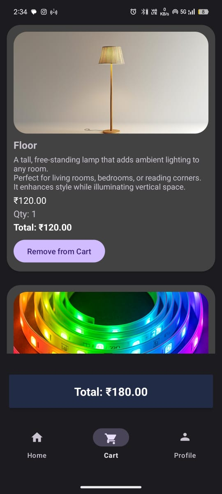
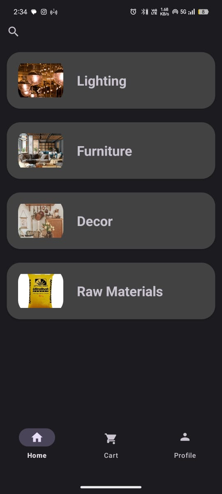
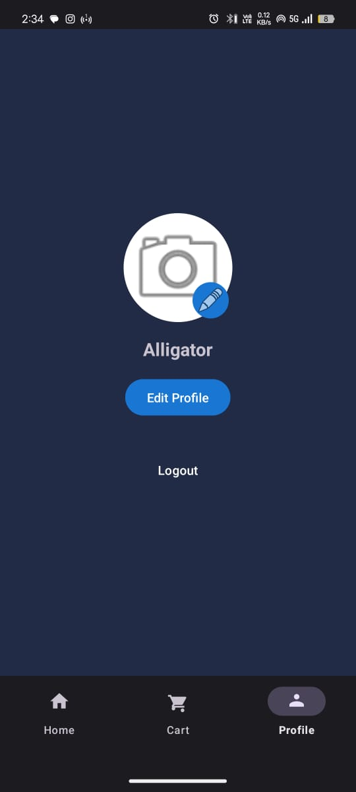
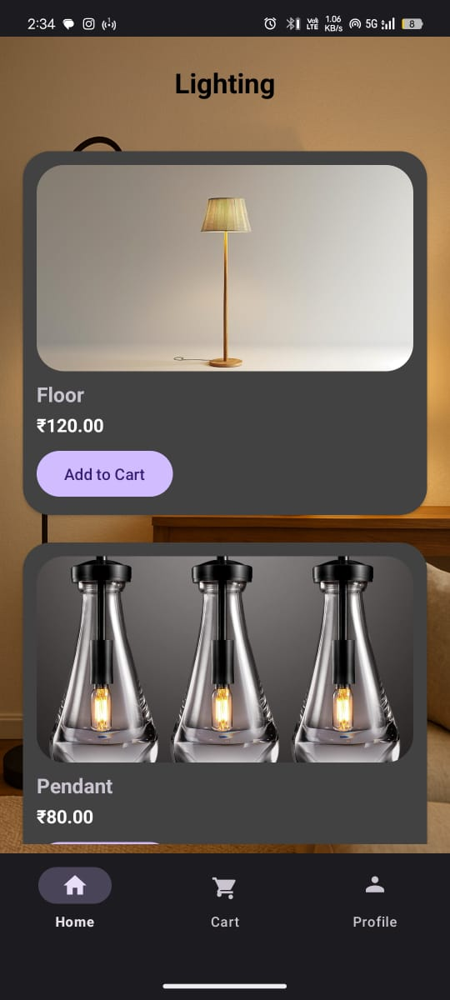

# Android Application – Kotlin Prototype

## Project Overview
This repository contains a prototype Android application developed using Kotlin as part of a hands-on learning and project-based development effort. The application was built to explore Android app architecture, UI design, navigation flow, and feature implementation using native Android tools.

## Project Objectives
- Understand native Android application development using Kotlin
- Design clean and intuitive user interfaces using XML
- Implement navigation and activity flow
- Build a functional mobile application prototype
- Gain practical experience with Android SDK components

## Key Features
- Clean and user-friendly UI
- Structured navigation between screens
- Core feature implementation based on the app concept
- Responsive layouts using XML
- Modular Kotlin-based logic

## Tech Stack
- Programming Language: Kotlin
- Platform: Android
- UI Design: XML Layouts
- Development Tool: Android Studio

## Demo (APK)
A working APK build of the application is provided for demonstration purposes.

## Source Code Note
The source code is not included in this repository due to project size, dependency constraints, and file upload limitations. This repository is intended to showcase application functionality and design rather than serve as a full open-source codebase.

## Learning Outcomes
- Practical experience in Kotlin-based Android development
- UI/UX design for mobile applications
- Activity and navigation handling
- Debugging and testing Android applications
- Converting an idea into a working app prototype

## Future Enhancements
- Backend and API integration
- UI/UX improvements
- Performance optimization
- Feature expansion

## Disclaimer
This project is a prototype developed for learning and demonstration purposes and is not intended for production deployment.

## Screenshots

